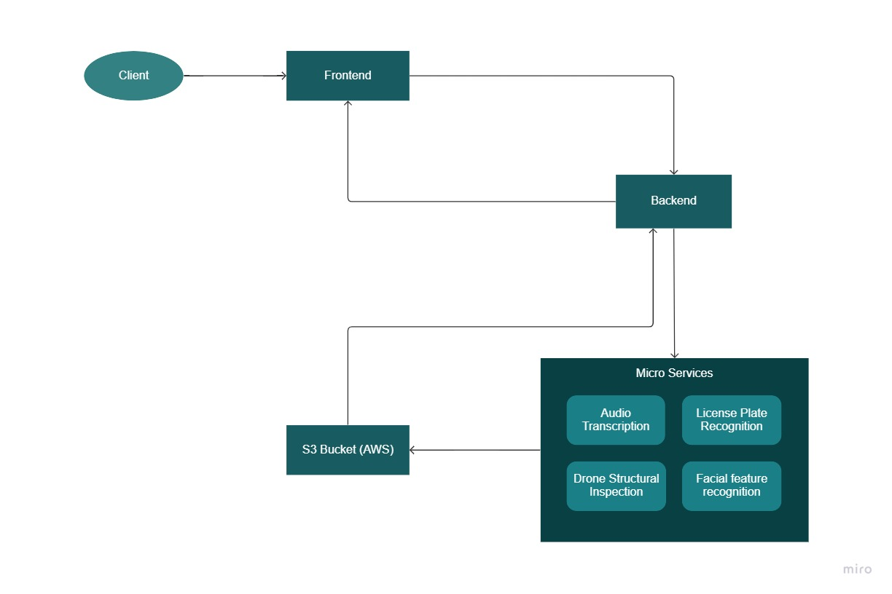

*visnet-docs.github.io*
=====================

## Introduction:

Welcome to the documentation for our [ViSNET AI](https://visnetai.co/) application! In this document, we will provide an overview of the AI application, its purpose, and its capabilities. We will also outline the different components that make up the application and provide instructions on how to use them.

Our AI application is designed to provide users with intelligent and automated solutions to complex problems. It uses advanced algorithms and machine learning techniques to analyze data and provide insights and recommendations to users.

The application is divided into several modules, each designed to handle specific tasks. The modules work together seamlessly to provide a cohesive user experience. The modules include data ingestion, data preprocessing, model training, model validation, and inference.

To use the application, users will need to provide data that the application can analyze. The data should be in a structured format, and users will need to follow specific guidelines for data formatting and cleaning. Once the data is ingested into the application, the data preprocessing module will clean and transform the data into a format suitable for model training.

The model training module uses advanced machine learning algorithms to train models on the cleaned data. The module provides users with a wide range of algorithms to choose from, and users can experiment with different algorithms to find the best fit for their data.

Once a model has been trained, the model validation module will test the model on a set of validation data to ensure that it is accurate and reliable. The module provides users with detailed metrics to help them evaluate the model's performance.

Finally, the inference module allows users to use the trained model to make predictions on new data. The module is designed to be user-friendly, and users can input new data into the module and receive predictions quickly and accurately.

We hope this documentation provides a comprehensive overview of our AI application and its capabilities. If you have any questions or need assistance using the application, please do not hesitate to contact our support team.

## Architecture:

<iframe width="768" height="432" src="https://miro.com/app/embed/uXjVPhofS_U=/?pres=1&frameId=3458764547703090232&embedId=81715124679" frameborder="0" scrolling="no" allow="fullscreen; clipboard-read; clipboard-write" allowfullscreen></iframe>

## Tech Stack:

Frontend:
The client side of the application is built upon Next.JS which is framework on top of React.JS. Next.JS supports pre-rendering, code-splitting, inbuilt routing, it is incredibly fast and brings in many optimizing techniches to make the application fast and reliable.

Backend:
The server side of the application is built on Python with FastAPI framework. FastAPI is a RESTful web framework for building high performant, robust and production ready web server with Python.

Microservices:

Cloud service:

## Guide to getting started:

For developers, to get started clone this repository using the below git command.

<code>git clone https://github.com/visnetai/visnet-frontend-interface.git</code>

Navigate to the local repository and run the following command in the terminal to install all the dependencies.

<code>npm install</code>

To start the development server of the application run the below command in the terminal.

<code>npm run dev</code>

## Userflow:

For detailed view of the app userflow please follow the below presentation.
<iframe width="768" height="auto" src="https://miro.com/app/embed/uXjVPhCOrcc=/?pres=1&frameId=3458764547795029900&embedId=617654303397" frameborder="0" scrolling="no" allow="fullscreen; clipboard-read; clipboard-write" allowfullscreen></iframe>
